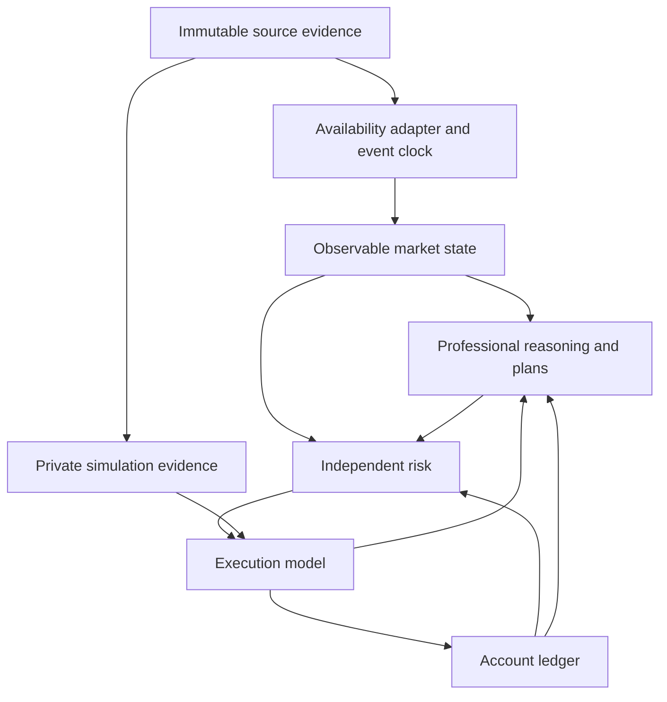

> **HISTORICAL SCOPE NOTICE — 30 September 2026.** FOUNDATION.md v3.0 implements the Owner's direct clarification and supersedes inconsistent scope/workflow instructions below. This document is retained as historical/advisory evidence. Its former ACCEPTED/READY/HOLD status is not current authorization. In particular, the mandatory pullback-only path, blanket cycle/news deferrals and RP-001 closure gate are no longer project direction. Reuse compatible findings only through the current task; preserve original evidence and failed cases. See the current FOUNDATION.md, STATE.md and task.md.

# ASTRA SR-001 — Pre-real-trader architecture review

**Disposition: REVISE before the next implementation; proceed with M3 after the Director accepts the revised boundaries.**

Date: 2026-09-30. Reviewed repository: [C-Gian/algorithmic-trader](https://github.com/C-Gian/algorithmic-trader/tree/b47b3cb72dbc23bc02caf40de1451d9949cb962c). Authoritative review commit: `b47b3cb72dbc23bc02caf40de1451d9949cb962c`, including the accepted WP-001–003 work. The brief refers to the WP-003 implementation commit; this review uses the later commit explicitly supplied by the Owner.

**Status: independent advisory review, not accepted project direction.** This document answers SR-001; it neither replaces FOUNDATION.md nor authorizes implementation. No implementation code or executor task instructions are included.

The current project instructions, FOUNDATION.md, STATE.md and AGENTS.md govern this review. The clean-room rule is preserved: professional source claims and their qualifications are admissible; legacy project designs, experiments and conclusions embedded in dossiers are not. The accepted scope is BTC perpetual, LONG/SHORT, one net position, intended exposure at most 1x equity, minutes-to-hours trading, research/paper only. Earlier foundation proposals do not supersede that scope.

Evidence is a static inspection of the pinned contracts, engine, trader, risk, account, acquisition code and selected tests, alongside the registry and relevant professional dossier sections. Tests were inspected, not rerun. Official OKX documentation was checked on the review date. These checks establish neither historical completeness nor actual execution quality. References and source qualifications appear at the end.

## 1. Recommended architecture

**Choose a hybrid: heterogeneous causal events update centrally owned observable state; the trader receives immutable, point-in-time snapshots, their changes, and causally bounded history.**

A synchronized frame may be a convenient projection of that state. It must not become the underlying truth or require all families to arrive together. Conversely, giving every professional reasoning module raw events would duplicate clock, gap and revision logic across the trader. That would make disagreements about data availability look like disagreements about the market.

Here, “causal” means information was available before its use. It does not assert that a chart-derived state identifies economic causes.

The private simulation path is privileged: it may resolve what happened after an order was submitted, but cannot expose future prices, rates or fills to the trader or its pre-trade risk state. Execution/account notifications cross the availability boundary before becoming decision inputs.

| Component | Responsibility and boundary |
| --- | --- |
| Evidence store | Preserve original responses, units, source identifiers, revisions, timestamps, checksums and quality. No trading interpretation. |
| Availability adapter and clock | Turn evidence into versioned deliveries under an explicit historical or measured-live timing policy; schedule expiries, expected arrivals and account events even when no traded candle arrives. |
| Observable market state | Maintain family-specific observations, coverage, age, validity and derived descriptive facts. Own causal aggregation and as-of history. Never silently substitute price roles. |
| Professional reasoning | Interpret descriptive facts into competing scenarios, expectations, invalidations and uncertainty. Maintain a market view while flat, blocked, or managing a position. |
| Plan and action policy | Connect a scenario to location, trigger, timing, expected room, intended loss and management rules; decide whether to act. Account state affects actionability, not the historical evidence. |
| Independent risk | Admit, constrain or reject orders; reserve pending exposure; monitor changing account and data risk; cancel or require reduction independently of new trade proposals. |
| Execution | Model admissible order lifecycles and uncertain outcomes using declared data capabilities and costs. Never equate approval with execution. |
| Account ledger | Record positions and cash consequences of fills, fees and funding exactly once; derive valuation using explicit marks and validity. It does not infer a trade thesis. |
| Durable runner and application | Commit input progress, state, timers and outputs atomically; expose the same semantic history during fast replay, restart and paper operation. |

**Keep descriptive state separate from professional interpretation.** Completed-range statistics and an explicitly defined, causally confirmed swing may be derived observations. “Buyers are defending support,” “liquidations drove the move,” and “continuation is likely” are interpretations. A swing that requires later confirmation becomes known at confirmation, not retrospectively at its extremum. Every derived fact retains its method version, dependencies and knowledge time.

The trader should organize knowledge by questions: What environment are we in? Where does price matter? What response would support or contradict the thesis? What move and time window are plausible? Is that opportunity executable at acceptable loss and cost? Different professional methods can answer different questions. They need not each produce a directional vote or standalone profitable strategy. Shared input lineage should reveal when several apparent confirmations are transformations of the same price history. [P1–P5]

Do not make the state service an omniscient indicator repository. Initially it needs typed family state, history access and a small number of transparent aggregations. Professional abstractions belong in versioned reasoning modules until their semantics are established. A persistent view may remain unchanged between meaningful updates; persistence does not require inventing a fresh opinion every minute.

## 2. Decisions to freeze now

Freeze the following **invariants**, not every field or research parameter.

| Decision | Reason |
| --- | --- |
| Evidence, observable state, interpretation, plan, risk, execution and ledger are distinct responsibilities. | Prevents data normalization from becoming strategy and risk approval from becoming an assumed fill. |
| Every decision has a committed input cutoff and resolvable dependency references. | Makes lookahead, revisions and explanations auditable. |
| Economic time, knowledge/availability time, retrieval time and processing order remain distinct. | An event can economically precede its discovery; retrieval in 2026 is not historical publication. |
| Events are heterogeneous; snapshots retain each family's age, validity and coverage. | Missing mark data must not erase a valid traded-price observation or masquerade as a fresh frame. |
| Traded, mark, index, forecast funding and settled funding retain explicit roles. | Prevents valuation, execution and interpretation from sharing an ambiguous “price” or “rate.” |
| Contract count, BTC equivalent, USDT notional and USDT equity are separate quantities. | Prevents dimensionally valid-looking but economically wrong sizing. |
| Ledger effects and order transitions are idempotent and independently reconstructible. | Recovery must not duplicate fees, fills or funding. |
| Unknown, stale, absent, invalid and inapplicable are distinguishable. | None means zero, neutral or permission to trade. |
| Independent risk reacts to marks, fills, funding, stale-data timers and order changes. | A trader's HOLD cannot suspend account protection. |
| Execution and availability assumptions are versioned research inputs. | A reproducible result is conditional on its simulator, not verified merely by its trace hash. |
| v1 artifacts retain their original interpretation; real-data economics cannot silently use demo semantics. | Preserves accepted work without making scaffolding a permanent constraint. |

The 1x mandate remains binding. Freeze its measurement as absolute mark-valued exposure divided by positive, valid account equity, alongside pre-trade reservations and costs. Also freeze the distinction between **admitting new exposure within the limit** and **detecting/responding to a market-induced breach**. No system can guarantee a continuous ceiling through discontinuous prices and unavailable execution. Calling a proposal check a perpetual hard ceiling would be false.

## 3. Decisions explicitly not to freeze yet

- **Professional ontology:** final scenario taxonomy, context lenses, level definitions, interactions, playbooks and calibrated confidence. CONTINUATION/BALANCE/TRANSITION is a demo vocabulary, not an exhaustive theory of markets.
- **Cadence:** observation frequency, decision triggers, higher-timeframe windows, warmup requirements and family-specific staleness thresholds. Freeze the ability to express these policies; choose values for documented purposes and validate them.
- **Predictive machinery:** exact features, volatility estimators, scenario scoring, learned models, or a universal scalar forecast. Qualitative confidence must not acquire an invented probability interpretation.
- **Execution precision beyond available evidence:** queue priority, market impact curves, inferred bid/ask, intrabar paths and exact funding-boundary order. Coarse data cannot settle those questions by architectural decree.
- **Venue breadth and advanced account modes:** keep the first instrument explicit. Do not generalize now to arbitrary derivatives, multi-collateral portfolios or authenticated execution.
- **Permanent restrictions inherited from the dummy:** one active plan, one pending order boolean, mandatory proposal per observation, fixed expiries and fixed bar-index schedules. The accepted first-version action scope remains; those storage conveniences are not professional principles.
- **Schema permanence:** v2 will be another honest baseline, not a claim that the final trader vocabulary is known.

Defer numerical choices, not their ownership or provenance. Every run still needs fully specified versions and parameters; “unfrozen” means deliberately revisable between runs, never undefined inside one.

## 4. semantic.v1 / semantic.v2 strategy

**Introduce `algotrader.semantic.v2` now, before real datasets enter the trader/account path. Keep `algotrader.marketdata.v1` as the accepted evidence baseline.**

The breaking changes are already substantive: BTC-like quantities become contract quantities; the single observation becomes heterogeneous inputs/state; funding becomes an actual cash event; mark validity becomes economically significant; fixture identity no longer identifies all run inputs. Hiding these changes in internal dictionaries to preserve the v1 name would preserve syntax while breaking meaning.

v2 should define the minimum durable boundary:

- typed event envelope with identity, source/provenance, economic interval/time, availability basis, ordering and revision information;
- observable-state/snapshot identity, causal cutoff, family-specific validity, and dependency references;
- explicit units and immutable instrument-specification references;
- separation of market interpretation from plan/action, with versioned reasoning payloads rather than arbitrary untyped extensions;
- order, fill, funding and valuation records with both effective and known times where they differ;
- run identity covering dataset composition, content, timing, account/execution/risk models and code/configuration versions;
- explicit capabilities and validity of a result: DEMO, observation-only, simulated economics, or later paper operation.

Do not finalize a comprehensive professional scenario schema merely to publish v2. Existing useful view fields can be retained provisionally under an explicit reasoning-model version. Likewise, market-data normalization and execution model versions should not be conflated with the public semantic version.

Preserve v1 schemas, artifacts and their historical reader. Old runs remain DEMO; never relabel or recalculate them as real perpetual results. Continue the old deterministic fixture as a regression baseline through a legacy-version path. A new v2 synthetic fixture proves the new semantics separately. Compatibility means continued intelligibility, not identical hashes across changed economics.

WP-003 evidence need not be rewritten for a stricter timing model. A run can reference the original evidence plus a versioned, explicitly recorded availability transformation. Do not silently mutate its stored `available_time`. If future acquisition needs genuinely new source fields or corrected normalization meaning, that is a separately versioned market-data change.

## 5. Deterministic causal ordering and freshness

### 5.1 Two timelines and one committed history

For each event distinguish **economic occurrence**, **availability to the consuming system**, and **committed processing sequence**. For candles, preserve the covered interval. For live data, record actual receipt order/times where available. For historical REST data, declare an availability model; exact bar close is a lower-bound convention, not evidence of zero publication latency.

The replay driver must expose only deliveries at or before its current knowledge cutoff. A private exchange simulator may inspect later historical records to resolve an already submitted order. Its outputs become visible according to an explicit execution-report policy. That separation prevents an “exchange world” price from leaking into pre-trade risk or market reasoning.

Maintain an economic ledger and an as-known account projection when reports are delayed. A late funding report can record an earlier effective cash event without revising earlier decisions. Until its amount is known, the account may have a pending or bounded liability and restricted sizing; it must not advertise an unqualified current equity. An end-of-run reconciled ledger is not proof that every intermediate decision used that reconciled knowledge.

### 5.2 Recommended ordering convention

Use actual captured source/receipt ordering when available. For reconstructed history, use a versioned total-order convention over availability time, causal phase, stable family/source identity and record identity. Filesystem, fetch-page and database-return order are not tie-breakers. A parent event must precede its consequences.

For an explicitly modeled same-availability batch, the reference phase order should be:

1. Deliver already-due execution/account reports and apply economic obligations resolved under the selected model; decisions in this batch cannot change prior commitments.
2. Apply market-family deliveries and quality/revision events to observable state.
3. Evaluate freshness deadlines and scheduled timers against the updated state; produce the snapshot and valuation status.
4. Reconcile independent risk, then update professional reasoning/management when scheduled; arbitrate risk-required reductions ahead of discretionary increases.
5. Record decisions and submit new orders. Newly submitted orders cannot fill in a phase already processed.

This is a **simulation convention**, not a universal exchange ordering claim. In particular, delivery order cannot decide whether an economically simultaneous fill preceded funding assessment. Resolve that separately in the economic model. Where source evidence cannot establish the ordering, flag it and evaluate admissible alternatives; do not silently choose the more profitable result.

Do not batch actually asynchronous live receipts merely because their source timestamps match. If batching/coalescing is desired, its waiting period is itself a causal policy, with timers and latency represented in both replay and paper operation.

Checkpoints must cover input cursors, pending deliveries/timers, family state, derived histories, trader/plan state, orders, account state and the journal cursor. Operational pause/speed changes do not change semantic time. The UI may offer “next event” and “next decision”; the canonical commit unit must no longer mean one traded candle.

### 5.3 Price roles and incomplete information

| Information | Primary role | Missing/stale behavior |
| --- | --- | --- |
| Traded OHLC and separately typed volumes | What traded during the interval; price structure and activity. Potential execution reference, not an executable quote. | Age affected market facts; suspend dependent triggers. Never invent a tradable price from mark/index. |
| Mark | Account valuation and risk; potentially contextual divergence from traded price. | Retain last value with age, but mark valuation degraded/unavailable. Block new exposure when valid sizing cannot be established. |
| Index | External benchmark for the perpetual and basis context; not a fill price. | Make dependent basis/context claims unavailable; other price-based reasoning can continue. It need not automatically disable all trading. |
| Forecast/indicative funding | Potential holding-cost and derivatives context, only if timestamped as known before settlement. | Do not substitute the later realized rate. WP-003 does not establish a pre-settlement forecast history. |
| Realized funding event | Settlement obligation; afterwards, historical context. | Missing rate, eligibility or valuation evidence creates unresolved cash consequences, not zero funding. |

All four source families may inform reasoning in their proper roles. Funding is not exclusively an accounting field, and mark/index are not independent directional confirmations. Basis and funding do not, by themselves, identify crowding, liquidation intent or expected future spot direction. [P6–P7]

Freshness has at least three dimensions: time since the represented market interval, time since receipt, and coverage/completeness of the dependency window. A newly received old observation is not fresh market information. Carrying the last valid value in state is permissible **with its original timestamp and stale status**; fabricating an intervening candle is not.

Concrete behavior:

- **Traded candle present, mark missing:** update market interpretation; keep valuation explicitly degraded; block increases lacking reliable equity. Reduction/exit remains eligible for risk consideration, but execution still requires valid executable evidence.
- **Mark/index arrives later:** update only at that delivery. Revalue and reconsider affected decisions prospectively. Do not reconstruct the earlier snapshot as if the late record had arrived on time.
- **Funding and candle share a timestamp:** neither grants access to the other's later information. Previously incurred funding cannot be escaped by a decision triggered by the just-completed candle. Boundary-position ambiguity is treated explicitly below.
- **One family stale, another fresh:** invalidate dependent facts and plans selectively. Missing irrelevant index context should not erase an otherwise supported directional view.
- **INVALID row:** retain it for audit; emit a quality event, exclude its numeric payload from valid state, and break affected coverage. Dataset-wide INVALID need not forbid all data inspection, but affected economic intervals cannot be admitted as clean evaluation evidence.
- **Missing arrivals:** scheduled deadlines advance staleness even during a data outage. Funding is not stale merely because no new event arrives every minute; its expected schedule is a separate, versioned fact.
- **Corrections:** apply append-only revisions when known. A late older bar can change a newly computed history-derived fact, but cannot reset the latest price or rewrite prior decisions.

A historically revised REST series may not reveal the original publication/revision history. Preserve that limitation in the run; timestamps alone cannot manufacture point-in-time completeness.

## 6. Minimum perpetual accounting and execution before trader evaluation

### 6.1 Account model

Adopt a **single USDT-collateral, one-way net-position research account**, with all collateral available to that one position and no borrowing or other assets. This is a declared simplified account, not a complete emulation of every OKX unified-account mode.

Let signed contract quantity be `n`, verified BTC per contract be `c`, BTC equivalent be `q = n × c`, fill price be `p`, average entry be `a`, and mark be `m`. Prices are USDT/BTC. Where the instrument definition requires it, `c = ctVal × ctMult`; do not assume a multiplier is already included or silently accept an invalid value.

| Quantity/event | Required economic treatment |
| --- | --- |
| Gross exposure | `abs(q) × m` USDT; signed exposure is `q × m`. |
| Unrealized P&L | `q × (m − a)` for a valid mark and open linear position. Unknown mark means unknown valuation, not zero P&L. |
| Same-side fills | Quantity-weighted average entry; retain dimensional consistency and specified rounding. |
| Partial reduction | Realize `closed_BTC × (p − a) × sign(old_q)`; remaining average entry is unchanged. |
| Full close | Realize the remaining P&L; reset position and entry. First-version action policy need not permit reversal, even if ledger arithmetic can represent it. |
| Trading fee | Cash debit based on executed notional and the applicable declared fee schedule; record currency, rate, liquidity role and calculation reference. |
| Funding | Signed cash change `−q_at_assessment × m_at_assessment × applied_rate`, under the declared settlement model. No position means no funding obligation. |
| Collateral balance | Initial USDT plus realized trading P&L, minus fees, plus signed funding and any explicitly modeled external flows. Initial version can prohibit subsequent flows. |
| Equity | Collateral balance plus mark-based unrealized P&L. Margin reservations constrain available resources; they are not another P&L loss. |

Opening a perpetual does not purchase BTC and deduct the whole notional as spot inventory. Closing does not return a fictitious spot-sale principal. Use Decimal arithmetic with instrument- and ledger-specific precision/rounding, not a universal eight-decimal rounding rule for every quantity.

Risk needs **all three dimensions**: contracts for admissible orders, BTC equivalent for price sensitivity, and USDT notional/equity for exposure. Include intended loss, fees, funding and stressed execution in admissible size; do not size solely to the exposure maximum. Planned stop loss is an estimate, not a guaranteed maximum loss.

Sizing must respect contract lot/minimum quantities and prices must respect the appropriate tick convention. Round exposure-increasing quantity down. Explicitly handle reduction dust and minimum-size exits. Check worst-case outstanding orders and revalidate at execution, rather than assuming an approved target is the final position. An execution-time check must correspond to a modeled venue rule or a causally issued cancel/replacement; it cannot retroactively resize an order using its eventual fill price. Reduce-only orders must never create reverse exposure.

**The existing 1x test is insufficient.** Fees can put a position sized to exactly 1x over the limit immediately. A short of 0.1 BTC entered at 100,000 against 10,000 USDT equity reaches 11,000 notional against 9,000 equity if price rises to 110,000, even before costs: approximately 1.22x. Reserve a documented buffer, monitor actual marks/cash changes, and prioritize corrective reduction when breached. An inability to execute is an observable risk incident, not a reason to silently declare compliance. Nonpositive equity means distress/undefined exposure ratio, never zero exposure fraction.

The account must also have a bounded solvency model. At most 1x is not immunity from liquidation, especially for shorts. Before evaluation, either represent verified maintenance-margin/forced-close rules for the selected mode, or define a conservative supported operating envelope and stop the economic simulation as **unresolved/invalid** at its boundary. The latter is sufficient for an initial research model, provided such runs are reported as failures/limitations and never dropped from the sample or treated as successful exits. A stop cannot guarantee that the boundary will never be crossed. Full liquidation-engine emulation can wait; pretending insolvent positions continue normally cannot.

### 6.2 Funding and instrument history

The official API distinguishes `fundingRate` as predicted and `realizedRate` as actual. Use a verified actual-rate mapping for settlement, preserving `method` and `formulaType`; absent actual data must not silently fall back to a predicted rate. The historical row's predicted field also does not establish when that prediction was available before settlement. Nor should a generic old/new formula label be assumed to identify every later formula revision. [O1]

OKX's funding documentation bases the linear-contract obligation on mark-valued position size, and states that actual assessment can extend up to a minute beyond the nominal time. Thus `fundingTime` alone does not establish the precise eligibility of a position changed near that boundary. The documented formula/schedule has changed; a current rule must not be retroactively applied to all history. [O2–O4]

For initial bar research, use nominal-time settlement with a named mark-selection convention as the reference model, **flag every position change in the potentially ambiguous assessment window**, and stress eligible position/mark alternatives. A previous completed mark close is a proxy, not the exact assessment mark; a candle high/low is a possible bound, not a timestamped path. If results or risk compliance materially depend on that uncertainty, classify them as unresolved and obtain finer evidence before economic acceptance. Do not label this model exchange-exact or a guaranteed conservative bound.

Apply each funding event once, including across restarts and dataset joins. Prove funding-event coverage for periods with exposure; an empty response or a non-candle family quality status is not proof that nothing was owed. Account for startup positions, end-of-run open positions and unsettled obligations explicitly. WP-003 selects candles by open time and funding by settlement time: the last candle can close at the exclusive dataset end while a funding event at that same end is excluded. An evaluation manifest therefore needs explicit warmup, decision and settlement coverage, not just one shared start/end pair. Report terminal marked equity separately from hypothetical liquidation proceeds; do not manufacture an unrecorded closing fill.

Pin contract specifications, fee assumptions, funding policies and rounding rules in the run manifest by immutable reference/hash. Historical effective intervals and retrieval timestamps are different. The current instrument snapshot does not prove the same tick, lot or contract value applied throughout a historical dataset. Unknown history requires a bounded justified assumption or an unsupported interval. Parameter changes must not reinterpret existing positions using a newly fetched contract size.

### 6.3 Execution model with one-minute OHLC

The minimum is a transparent **coarse market-order simulator**, not an inferred order book. It can support behavioral evaluation and provisional economic screening. It cannot establish the realizable edge of every minutes-scale strategy. [P1, P2, P7]

| Topic | Required before economic evaluation | Deferrable refinement |
| --- | --- | --- |
| Timing | Separate decision, submission, eligibility, economic fill and report times. No fill before eligibility; no use of final candle information to place an order earlier inside that candle. | Measured latency distribution and tick-level execution. |
| Reference price | For a simple completed-bar baseline, the first bar open **strictly after** submission plus modeled latency, with explicit fill/report timing. A same-boundary open requires a separately justified ordering assumption and is not the default. | First executable quote/trade after arrival using finer data. |
| Costs | Explicit taker fee, spread/liquidity allowance and slippage assumptions; preserve decision reference for execution shortfall. Avoid double-counting spread inside another allowance. Run sensitivity scenarios. | Calibrated state/size-dependent impact. |
| Missing execution evidence | No stale-price fill, unlimited pending order, or automatic fill at the next surviving candle regardless of elapsed time. Use declared order expiry and an unresolved-execution policy. A missing archive record does not prove the exchange failed to fill. | Reconstruct actual venue outcomes from richer records. |
| Exits and stops | Distinguish an observed thesis invalidation from a previously active protective trigger. Specify last/mark/index trigger role. A newly recognized close-time invalidation exits only subsequently. | Venue-native stop behavior and precise intrabar triggering. |
| Intrabar uncertainty | Never select the favorable order of entry, stop and target from OHLC. Use declared adverse-path/bounded alternatives, or declare unresolved. Gap-through stops need adverse execution beyond the stop. | Tick/quote paths and more precise liquidity modeling. |
| Fill amount | Full-fill baseline only under an explicit small-order/capacity assumption; allow rejection, expiry and failed execution in the model. Future completed-bar volume cannot justify earlier sizing. | Calibrated partial-fill and passive-order queue models. |
| Fees/funding | Debit per fill/assessment, preserve effective and known times, include unresolved settlements. | Account-specific reconciliation after future authenticated connectivity. |

A later open is causally simple, but delay is not always economically adverse. Do not call next-open-plus-slippage universally conservative. Stress timing as well as cost; report how the conclusion changes. Likewise, placing an arbitrary adverse price inside an OHLC range does not prove an executable price existed.

Partial-fill **calibration** can be deferred for the initial small market-order model. The order/account boundary should nevertheless support cumulative filled quantity, remaining quantity and cancellation, so later partial fills do not require redefining what a position is. Passive limit strategies are outside the first economic model.

### 6.4 What constitutes sufficient validation

Before real trader economic evaluation, require independently calculated long/short open-reduce-close cases; positive/negative/zero funding; contract conversions and rounding; fee-induced and market-induced cap breaches; stale/absent mark behavior; funding/fill boundary ambiguity; gaps and expiry; restart around every ledger transition; and ledger reconstruction without duplicate effects. Check intermediate account states, not only terminal equity.

Causality evidence should include prefix invariance by **availability cutoff**, late-delivery cases, source-family permutation within the declared convention, and equality across pause/speed/recovery. Do not truncate simulator outcome evidence needed to settle an already submitted order and then mistake that changed outcome for prediction leakage; compare like-for-like known histories. Arithmetic checks need independent expectations, not only a second call into the same account implementation.

Later trader validation must separately ask: Did it perceive and manage the documented situation coherently? Did its expectations discriminate outcomes? Were selected actions attractive after risk and costs? Use bounded, source-grounded cases and whole-trader evaluations, including abstention and adverse examples. Record development trials, protect evaluation periods, and address overlapping outcome horizons. The dossiers disagree on how restrictive refinement should be; permit reasoned development on declared development data, never relabel an inspected evaluation set as unseen. No endless independent-indicator tournament is needed. [P2, P3, P5]

## 7. Review of WP-004 / WP-005 sequence

**Retain two implementation stages, but modify their contract and acceptance boundaries. Do not combine everything merely because accounting matters.**

The Director's ordering is sound only if “no economics yet” is an enforced capability, not a disclaimer attached to demo P&L generated from real prices. It is useful to prove real-data causality independently of trading economics. It is unsafe to build that replay around v1's single-bar trader boundary and defer the architectural break to WP-005.

| Stage | Recommended architectural outcome | What its acceptance does not establish |
| --- | --- | --- |
| Before WP-004 implementation | Director accepts the event/state boundary, v2 direction, price/unit roles and the accounting/execution conventions needing evidence. | No professional trading model is frozen. |
| Revised WP-004 | v2 causal event/state substrate, heterogeneous synthetic cases, then observation-only real-dataset replay; family freshness, timers, restart, provenance and UI inspection. Order/account interfaces may be reserved, but real-data trading capability is disabled. | No simulated trades, zero-looking equity curves or numerical performance results presented as real-data economics. |
| Revised WP-005 | Correct linear-perpetual ledger and independent risk; declared coarse execution/funding models; synthetic arithmetic and timing validation; integrated real-data simulations with explicit validity limits. | No profitable trader, exchange-exact fills, or intraday capacity evidence. |
| Following M3 acceptance | Strategic trader-design review chooses a coherent professional process and its data requirements; then implementation and bounded evaluation. | No obligation to use only the first four source families if the chosen process needs other evidence. |

Shared economic event identities and timing semantics must be designed before WP-004, even though cash arithmetic arrives in WP-005. That avoids two incompatible clocks. No separate execution engine should be built for replay merely to keep the dummy interface untouched.

Professional case analysis and narrowly targeted source work can proceed during M3. Deferring all trader-design thinking until infrastructure is complete would risk discovering too late that the architecture cannot express a required observation or trigger. Actual professional intelligence implementation remains after M3 acceptance and the trader-design review.

The shell remains valuable: visible launch/monitoring, durable jobs, checkpoints and immutable artifacts should carry forward. Observation-only replay should show real evidence and quality rather than fake professional conclusions. Integrated replay should later show which evidence, view, risk state and assumptions caused each action. Hours-scale experiments remain application-managed; acceleration changes pacing, not reasoning semantics.

## 8. Only material pre-trader knowledge gaps

The twenty-dossier registry is sufficient to justify the architectural separation. It is **not a complete operational specification of an excellent BTC intraday trader**. Practitioner testimony supplies process hypotheses; multi-asset trend evidence does not establish a minutes-scale BTC edge. A source-informed design still needs operational definitions and eventual economic evidence. [P3–P7]

| Gap | Blocking status | Minimum resolution |
| --- | --- | --- |
| Linear perpetual mechanics, funding eligibility, mark valuation, units and fees | Blocks economic simulation; does not block observation-only replay. | Resolve the selected account/instrument rules or declare a bounded supported model and unsupported cases as in §6. |
| One coherent professional context-to-trigger-to-management process | Blocks the first real trader specification. | Select a narrowly scoped professional process; document what is observed, what is inferred, expected response, counterevidence, timing, abstention and management. Use causal annotated examples, including failures. Do not synthesize every successful trader into one universal doctrine. |
| Multi-timeframe interaction and causal structural levels | Blocks any initial design that claims those capabilities; a minimal contextual trader should address them. | Explain how broader context conditions a local setup, how levels become known, how breaks/retests are recognized, and when the thesis expires. No retrospective pivot labels. |
| BTC intraday execution feasibility | Blocks credible economic acceptance; informs the initial design's viable horizon. | Obtain representative spread/liquidity and delay/cost evidence for the intended order size and conditions, or retain explicitly provisional stress bounds. One-minute OHLC is insufficient to certify a narrow, cost-sensitive edge. |
| Meaning of funding/basis as predictive context | Blocks only rules that use it predictively. | Distinguish observed premium/carry from claimed positioning, crowding or directional information. Obtain historically available inputs before asserting a pre-settlement inference. |

**Can be added later:** dependable order flow, open interest, liquidation-flow data, news/event context and cross-venue detail, if the selected process requires them. Their data quality and historical availability become prerequisites at that point. Basic liquidation/account solvency cannot wait; a strategy that predicts liquidation cascades can.

**Not prerequisites:** Fibonacci retracement/extension, a cycle theory, exhaustive technical-analysis literature, deep learning, all twenty sources implemented as modules, or a full exchange matching-engine replica. Retracement can initially mean measured movement relative to a causally defined swing without assuming special ratios. A clock and expiration policy do not require a predictive cycle doctrine.

The first trader-design review should deliver one integrated professional hypothesis with a bounded operating domain, not a list of indicators awaiting individual profitability tests. Its continuous market view must still represent uncertainty and plausible alternatives outside its tradeable domain.

## 9. Red-team findings on accepted work

These findings do not revoke WP-001–003 acceptance within their stated DEMO/evidence scope. They identify where reuse would become incorrect.

| Finding at the pinned commit | Consequence if carried into real trading | Required architectural treatment |
| --- | --- | --- |
| `Engine` and worker advance through `Fixture.bars`; `Trader.on_observation` requires a view and proposal on each step. | Turns the traded candle into the clock for marks, funding, expiries and risk. | Replace the long-lived boundary with events/state and independently scheduled evaluations. Preserve bar UI controls as conveniences. |
| Engine emits the completed observation, then fills a pending order at that bar's earlier open. Eligibility checks do not explicitly compare submission plus latency with that open. | The default fixture conceals timing assumptions; delayed deliveries can permit a retrodated fill. | Separate economic fill time from report time and enforce eligibility. Final bar quality cannot serve as knowledge that was available at the open. |
| `MarketObservation.volume` and BTC-like quantities are ambiguous; `CostAssumptions.funding` is literally NOT_MODELED. | A field-compatible adapter would misrepresent contracts, volumes and real cash flows. | Explicit semantic.v2 and dimensional conversion. |
| Account valuation uses last traded close; missing mark yields zero unrealized P&L, and nonpositive-equity exposure fraction can be zero. | Conceals unknown valuation or insolvency as a safe account. | Role-specific marks and valuation/distress states. |
| Risk checks proposals at a sizing price; `approved_exposure_within_1x` validates approvals, not the actual evolving account. | Fees, gaps, funding and adverse shorts can breach the mandate while validation remains green. | Admission plus continuous account monitoring, reservations and breach response. |
| One pending-order boolean blocks quantity-changing proposals, including exit, without a complete cancel/replace lifecycle. | An old entry or unavailable fill can obstruct urgent risk reduction. | Prioritized order management and explicit cancellation/remaining quantity. |
| Fill prices round to cents; full fills, fixed fee/slippage and indefinite next-available-open behavior are demo assumptions. | Violates pinned tick rules and hides execution uncertainty. | Instrument-aware rounding, expiry, timing and cost/capacity assumptions. |
| Fixed scenario enum, one active dummy plan and script-driven IDs/expiries. | Encourages the UI and contracts to dictate professional reasoning. | Keep stable scenario/plan lineage, but remove script-specific semantic restrictions from the real path. |
| WP-003 instrument metadata is a retrieval-time snapshot. `ctMult` uses a fallback expression that also maps numeric zero to one. | Retrieval-time metadata can be mistaken for historical truth; malformed multiplier can be silently normalized. | Verify effective specifications; reject invalid conversion values and record legitimate defaults explicitly. |
| Funding records have no candle-like row-quality field; quality reporting counts funding events without proving the expected schedule is complete. | “Clean” can be misread as complete settlement coverage. | Add economic admissibility/coverage checks without corrupting retained source evidence. |
| Conflicting duplicates are excluded; INVALID numeric rows remain in normalized evidence. | A naive reader can consume invalid rows or treat excluded conflicts as ordinary absence. | Explicit row admission and coverage-break events in the replay adapter. |
| Dataset ID includes acquisition choices/raw pages; 31 days is an acquisition bound. | Wrong deduplication, artificial research-window limits, or duplicate funding across stitched packages. | Maintain acquisition identity plus canonical economic record identities and a pinned dataset-composition manifest. |
| Validation reconstructs final account through the same account implementation and demands one decision per step. | Self-consistency can conceal shared arithmetic errors; the validator enforces the dummy cadence. | Independent mathematical oracles, intermediate-state invariants and event-aware validation. |

Two Foundation interpretations also need care. First, “continuously maintain a market view” must not mean every event produces a new forecast or trade proposal. Second, “integrate professional ways of reading the market” must not become mandatory breadth. A coherent, incomplete trader is more defensible than a collage of incompatible theories. No accepted material establishes that excellent professional process is sufficient for profitable BTC trading; comparative advantage and net economics still need evidence. [P4, P7]

## 10. Final recommendation

**REVISE, then GO with the modified M3 sequence. Maintain the current implementation hold until the Director resolves this checkpoint.** There is no reason to discard the accepted shell or evidence layer, and no need to stop for a broad research campaign.

The necessary decisions are:

1. Adopt heterogeneous events plus centrally maintained observable state; separate economic time from knowledge time.
2. Introduce semantic.v2 now while preserving v1 artifacts and marketdata.v1 evidence.
3. Keep WP-004 observation-only, with actual execution capability absent rather than merely discounted by a warning; establish the shared clock and contracts before WP-005.
4. Require explicit contract units, mark valuation, fee/funding ledger effects, continuous risk and a bounded execution/solvency model before economic evaluation.
5. Treat funding assessment timing, historical metadata, availability and OHLC execution ambiguity as model uncertainty requiring evidence or sensitivity analysis—not arbitrary precise facts.
6. Scope the first trader through one coherent professional reasoning process and causal cases; obtain only knowledge/data that its claims require.

**Stop-before-next-implementation conditions:** a proposal to feed real data through the current demo account; to keep BTC/contract or price-role ambiguity under the v1 name; to claim real P&L from observation-only replay; or to settle unresolved timing/valuation questions silently. Those choices would contaminate later research at its measurement boundary.

The strategic boundary to protect is straightforward: **the trader reasons from what it could know; risk constrains what it may attempt; execution determines what happens; the ledger records the consequences. None of those is evidence that the others were correct.**

## References and evidence scope

All repository references below are pinned to the review commit. Source dossiers were used for professional claims and limitations, not their legacy project recommendations. They are secondary research records; this review does not claim to have re-read their original full books.

- [Review brief](https://github.com/C-Gian/algorithmic-trader/blob/b47b3cb72dbc23bc02caf40de1451d9949cb962c/strategic_reviews/SR-001-PRE-REAL-TRADER-ARCHITECTURE.md), [FOUNDATION.md](https://github.com/C-Gian/algorithmic-trader/blob/b47b3cb72dbc23bc02caf40de1451d9949cb962c/FOUNDATION.md), [STATE.md](https://github.com/C-Gian/algorithmic-trader/blob/b47b3cb72dbc23bc02caf40de1451d9949cb962c/STATE.md), [AGENTS.md](https://github.com/C-Gian/algorithmic-trader/blob/b47b3cb72dbc23bc02caf40de1451d9949cb962c/AGENTS.md), README.md and task.md establish scope and the current hold.
- [Semantic and market-data baselines](https://github.com/C-Gian/algorithmic-trader/tree/b47b3cb72dbc23bc02caf40de1451d9949cb962c/schemas); [implementation](https://github.com/C-Gian/algorithmic-trader/tree/b47b3cb72dbc23bc02caf40de1451d9949cb962c/src/algotrader): contracts.py, engine.py, trader.py, account.py, risk.py, synthetic.py; marketdata/contracts.py, dataset.py, okx.py; validation.py and relevant worker.py boundaries. Account, risk and engine tests were inspected as evidence of current assertions, not proof beyond their scope.
- [OKX source decision](https://github.com/C-Gian/algorithmic-trader/blob/b47b3cb72dbc23bc02caf40de1451d9949cb962c/knowledge/market_sources/OKX-BTC-USDT-SWAP.md) and [knowledge registry](https://github.com/C-Gian/algorithmic-trader/blob/b47b3cb72dbc23bc02caf40de1451d9949cb962c/knowledge/registry.yaml).
- **P1 — Johnson, LIB-001**, §§4, 7, 9–10: execution versus investment decisions, order mechanics, costs and timing risk. Registry marks the dossier partially reviewed because of damaged source pages. [Dossier](https://github.com/C-Gian/algorithmic-trader/blob/b47b3cb72dbc23bc02caf40de1451d9949cb962c/source_notes/LIB-001-ALGORITHMIC-TRADING-AND-DMA.md).
- **P2 — Chan, LIB-003**, §§8–9, 12–14, 17, 21: point-in-time inputs, prefix invariance, costs, paper reconciliation and non-guaranteed stops. [Dossier](https://github.com/C-Gian/algorithmic-trader/blob/b47b3cb72dbc23bc02caf40de1451d9949cb962c/source_notes/LIB-003-QUANTITATIVE-TRADING-ERNEST-CHAN.md).
- **P3 — Carver, LIB-004**, §§3, 6, 16, 18, 24, and **LIB-008**, §§3–7: forecast/action separation, ideas-first research, redundancy and cost constraints. Forecast weighting is a source method, not a mandate for this project's whole reasoning architecture. [Carver dossier](https://github.com/C-Gian/algorithmic-trader/blob/b47b3cb72dbc23bc02caf40de1451d9949cb962c/source_notes/LIB-004-SYSTEMATIC-TRADING.md); [trend-equivalence dossier](https://github.com/C-Gian/algorithmic-trader/blob/b47b3cb72dbc23bc02caf40de1451d9949cb962c/source_notes/LIB-008-WHICH-TREND-IS-YOUR-FRIEND.md).
- **P4 — Market Wizards, LIB-005**, §§3–6: selected practitioner testimony, conditional setups, multi-timeframe context and process review; not controlled evidence of transferable causality. [Dossier](https://github.com/C-Gian/algorithmic-trader/blob/b47b3cb72dbc23bc02caf40de1451d9949cb962c/source_notes/LIB-005-MARKET-WIZARDS-THE-NEXT-GENERATION.md).
- **P5 — López de Prado, LIB-012**, Parts I–III: information timing, side/action separation, overlapping labels and research-selection risk; methodological disagreements with Chan/Carver are preserved. [Dossier](https://github.com/C-Gian/algorithmic-trader/blob/b47b3cb72dbc23bc02caf40de1451d9949cb962c/source_notes/LIB-012-ADVANCES-IN-FINANCIAL-MACHINE-LEARNING.md).
- **P6 — Hull, LIB-019**, §§3–6: contract mechanics, margin cash consequences and pricing versus forecasts. Traditional futures treatment is not evidence of a specific perpetual settlement rule. [Dossier](https://github.com/C-Gian/algorithmic-trader/blob/b47b3cb72dbc23bc02caf40de1451d9949cb962c/source_notes/LIB-019-OPTIONS-FUTURES-AND-OTHER-DERIVATIVES-6E.md).
- **P7 — Harris, LIB-020**, §§3–8: liquidity dimensions, order tradeoffs, information and comparative advantage. These are mechanisms, not calibrated contemporary BTC execution parameters. [Dossier](https://github.com/C-Gian/algorithmic-trader/blob/b47b3cb72dbc23bc02caf40de1451d9949cb962c/source_notes/LIB-020-TRADING-AND-EXCHANGES-MARKET-MICROSTRUCTURE-FOR-PRACTITIONERS.md).
- **O1 — [OKX API documentation](https://my.okx.com/docs-v5/en/)**, public instruments and historical funding response definitions. Checked 2026-09-30; predicted versus actual rate distinction and specification fields. Current documentation does not itself establish historical effective metadata or pre-settlement publication times.
- **O2 — [OKX perpetual funding mechanism](https://www.okx.com/help/perps-funding-fee-mechanism)**, page updated 2026-08-27; checked 2026-09-30. Funding assessment timing and changing schedules. Regional applicability and historical rules require separate verification.
- **O3 — [OKX funding calculation](https://www.okx.com/en-gb/help/how-to-calculate-future-funding-fee)**, page updated 2026-08-11; checked 2026-09-30. Contract/mark-based linear funding arithmetic and sign convention.
- **O4 — [OKX funding formula revision notice](https://www.okx.com/en-eu/help/important-update-revision-of-the-funding-rate-formula-for-okx-perpetual)**, published 2026-05-29; checked 2026-09-30. Announces June migration; does not identify the exact historical migration instant for every individual instrument.

Architecture choices, proposed model conventions, mathematical examples and acceptance boundaries in this review are the reviewer's recommendations or deductions. They are not attributed to the professional sources as established universal trading rules.
